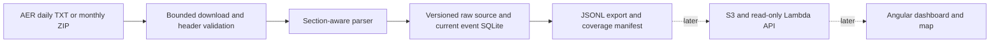

# Wellspring

Wellspring is a small Alberta well-licence explorer for an educational portfolio.
It uses the Alberta Energy Regulator's public ST1 reports. It is not an official
AER product and is not affiliated with or endorsed by the AER or GeoLOGIC.

## Current state

M1 runs locally: Python parser, event history in SQLite, bounded daily/archive
downloads, a real August 2026 sample month and JSONL export. The API, Angular
app, map coordinates, AWS deployment, daily cloud schedule and question box
are later milestones. There is no public application URL yet.

Josii designed and directed the project and reviews its work. Implementation
is by AI coding agents under his review: Tenjin owns backend/data work and
Nabu owns the Angular app. Tests and review evidence describe what ran, not a
claim that Josii independently wrote every line.

## Run locally

Python 3.11 or newer. The runtime has no third-party Python dependencies.

```bash
python3 -m venv .venv
.venv/bin/python -m pip install -e '.[test]'
.venv/bin/python -m pytest -q
.venv/bin/python -m wellspring.ingest.cli month 2026-08 \
  --archive fixtures/dwll2026-08.zip \
  --db data/wellspring.sqlite3 --output output/2026-08
```

Omit `--archive` to download the official monthly archive. The identified
`Wellspring/0.1` User-Agent is required by the observed AER download path;
403 responses are reported as failures, never treated as empty reports.

Daily files have rolling MMDD names. Always validate their report headers:

```bash
.venv/bin/python -m wellspring.ingest.cli range 2026-09-24 2026-09-25 \
  --db data/wellspring.sqlite3
```

Use monthly archives for historical data. `--stop-at` accepts an ISO timestamp
with timezone and prevents starting a fetch within 35 seconds of that deadline.
The backfill writes `manifest.json`, `events-<sha256>.jsonl`, and exact raw inputs under
the chosen output directory. SQLite and generated outputs are ignored by Git.
The manifest separates loaded, empty, missing, failed and stopped dates.
Read the export named by `manifest.json`'s `export_file`. Export content is
written first and the manifest pointer is replaced atomically. If publication
fails, the previous manifest/export stay consistent; the valid SQLite import
may be newer and a rerun finishes publication. Do not guess the newest file.
An archive download failure writes `last-attempt.json` without replacing a
previous dataset manifest. Failed ingestion is not a newly empty dataset.
The public record schema is v1; the local storage schema is v2. Unreleased
development v1 databases are refused with a rebuild instruction rather than
migrated incompletely. Rebuild into a fresh database from retained raw inputs.

## Data and limitations

Source: [AER ST1](https://www.aer.ca/data-and-performance-reports/statistical-reports/st1).
The AER labels these reports preliminary and subject to change. Noncommercial
educational reproduction requires source attribution, due diligence, and no
claim of official status or endorsement. Do not use the AER logo or treat this
demo as commercially licensed redistribution. See the
[AER copyright and disclaimer](https://www.aer.ca/copyright-and-disclaimer).
Fixture URLs and SHA-256 digests are in `fixtures/sources.json`.

An event key is `(licence_number, event_type, report_date)`. A licence can be
issued and cancelled on the same day. It can also have several updated UWIs
on the same day: these are ordered occurrences, not discarded duplicates.
Sparse change records do not inherit missing fields from unrelated events.
Changed fields preserve their exact labels and values; they do not silently
rewrite the old identity columns. Summary UWI is null when occurrences differ.

Coordinates are null in M1. DLS is parsed from the surface location only.
Later township-grid positions must be labelled approximate, not survey-grade.
No numeric point is inferred from a well name, a bottomhole location or an
unverified UWI normalization. Alphanumeric UWI prefixes are preserved.
The August fixture contains no separately titled reentry section; reentry
support currently has synthetic coverage and needs a real source example.



See `docs/API-CONTRACT.md` for Nabu's shared shapes and `docs/M1-EVIDENCE.md`
for measured fixture counts. `docs/SPEC.md` remains the overall scope.
