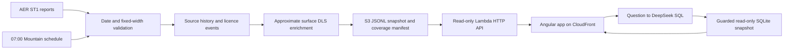

# Wellspring

Wellspring explores Alberta well-licence activity from the Alberta Energy
Regulator's public ST1 reports. It preserves report sources, distinguishes new
licences from changes, and shows approximate surface positions where supported.

[Open the live demo](https://d157m2vmtz6y3j.cloudfront.net/) ·
[Read the API](https://yjzy2hz1z1.execute-api.ca-central-1.amazonaws.com/licences?page_size=2)

This is an independent educational portfolio project. It is not an official AER
product and is not affiliated with or endorsed by the AER or GeoLOGIC.

## Current state

The ingestion pipeline and read-only API are live on AWS. The Angular frontend
uses live data and includes a dashboard, licence table, map, Ask and About.
Ask turns a question into inspectable SQL and runs a guarded, read-only query
against the public dataset. It uses DeepSeek, limits answers to 200 rows and
shares a 100-attempt daily allowance across the demo. Unsupported requests and
unavailable services produce explicit refusals. See [the evidence record](docs/EVIDENCE.md)
for deployed versions, checks and known limitations.

The current backfill covers January 1 through September 27, 2026, with 266 valid
report dates and 8,811 events. Four report dates failed strict source validation
and remain explicit gaps. Coverage reports missing, failed, empty and loaded
dates separately. A source that has not published yet must not be drawn as a
zero-event day. See [the live query receipts](docs/ASK-RECEIPTS.md).

## Run locally in five commands

Use Python 3.11 or newer and the Node version required by `web/package.json` and
its lockfile. The current Angular toolchain needs Node 22.12 or newer; the local
verification recorded in the evidence file used Node 26.10.0.

```bash
python3 -m venv .venv
.venv/bin/python -m pip install -e '.[test]'
.venv/bin/python -m wellspring.ingest.cli month 2026-08 --archive fixtures/dwll2026-08.zip --db data/wellspring.sqlite3 --output output/2026-08
npm --prefix web ci --no-audit --no-fund
npm --prefix web start
```

The frontend opens on localhost:4200 and uses the live API by default. For an
offline UI session, set its documented `mock` flag in
`web/src/environments/environment.ts`. The local ingestion command above creates
a SQLite database and export; it does not deploy an HTTP server. Run checks with
`.venv/bin/python -m pytest -q` and
`npm --prefix web test -- --watch=false`; `npm --prefix web run build` checks the
production templates and bundle.

## How the data moves



A licence can be issued and cancelled on the same day. It can also have several
updated well identifiers on that day. The event key is licence number, event
type and report date, with ordered occurrences retained under each event. Sparse
amendments do not silently borrow fields from other events. Original labels,
source lines, raw bytes, hashes and parser versions remain inspectable.

Source filenames contain only month and day and can retain last year's report.
The header date must match the requested date. Invalid record structure or dates
cannot replace a valid published day. A location the map cannot interpret is
preserved as a nullable field with a reason instead of dropping the licence.

The API loads only the export named by its manifest and verifies its byte hash.
Publication writes the immutable export first and switches the manifest last.
A failed refresh preserves previous valid source dates and reports the failure.

## Approximate map positions

Positions come from the surface legal land description, never the well name or
bottomhole identifier. The offline township-grid approximation was checked
against 77 source-linked Government of Alberta ATS polygons, including seven
held-out checks. Maximum observed centre-to-centre error was 1.201 km on those
samples. This is not a universal error bound or a surveyed wellhead position.
Unsupported or missing descriptions remain null with a reason. See
[the method, reference data and limits](docs/DLS.md).

## Deploy and operate

[Deployment instructions](docs/DEPLOYMENT.md) describe the single CloudFormation
template, private data/site buckets, CloudFront access, scoped function roles,
immutable packages and deployment verification. Deployment requests are recorded
separately from successful deployed-code verification. The daily schedule uses
`America/Edmonton` so 7am Mountain follows daylight saving time.

[The API contract](docs/API-CONTRACT.md) documents filters, pagination, points,
coverage and Ask responses. [Cost and access evidence](docs/COST-ACCESS.md)
records current limits and assumptions. The owner-managed budget alarm is not a
spending cap. Secrets are never part of the repository or deployment package.

## Sources and terms

ST1 is preliminary data and may be revised. The AER source and reproduction terms
are linked below. Noncommercial educational reproduction requires attribution,
due diligence and no suggestion of official status or endorsement. This demo
uses no AER logo and does not claim commercial redistribution rights.

- [AER ST1 reports](https://www.aer.ca/data-and-performance-reports/statistical-reports/st1)
- [AER copyright and disclaimer](https://www.aer.ca/copyright-and-disclaimer)
- [Government of Alberta ATS subdivision layer](https://geospatial.alberta.ca/titan/rest/services/ags_apps/ags_apps_alberta_township_system/MapServer/3)
- Fixture source URLs, hashes and retrieval notes: `fixtures/sources.json` and
  `fixtures/dls-reference.json`.

## How this was built

Josii directed Wellspring and reviewed its changes in Scriptorium. Tenjin and
Nabu are AI coding agents: Tenjin implemented ingestion, the API and AWS setup;
Nabu implemented the Angular app. The work used automated reviews, tests and
runtime checks, with evidence and limitations recorded alongside each milestone.
Data comes from the Alberta Energy Regulator's public ST1 Well Licences Issued
Daily reports. Map positions are approximate, derived from legal land
descriptions with the township grid method.
